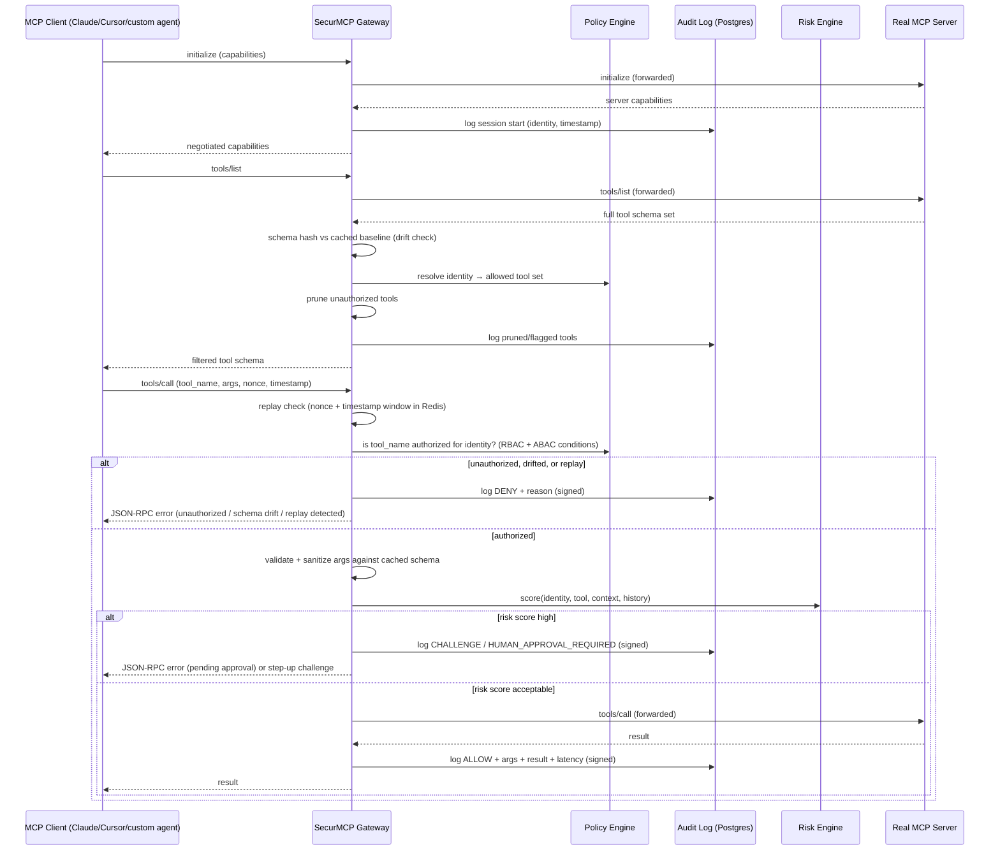
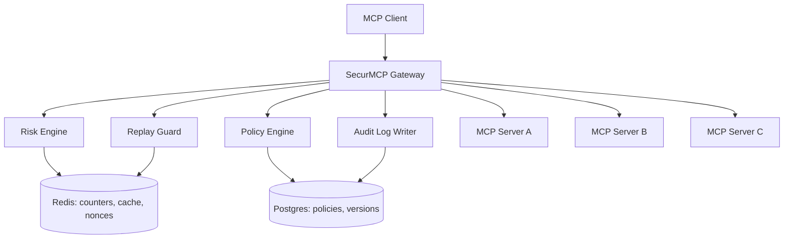
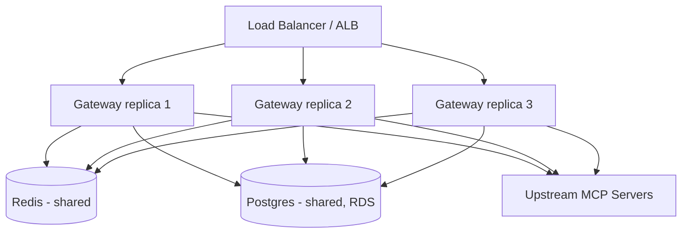
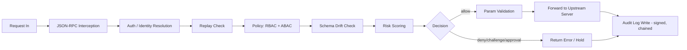

# Architecture

Core design of SecurMCP: the decision pipeline, every component, failure behavior, hardening, observability, and how it's tested, built, and deployed. See [`README.md`](./README.md) for the pitch and [`THREAT_MODEL.md`](./THREAT_MODEL.md) for what this design does and doesn't protect against.

> Section numbers below start at 4 and internal cross-references (e.g. `§4.5`, `§5`) refer to headers within *this file* — the numbering is inherited from when this was one combined spec document and preserved here so nothing needed renumbering during the split.

---

## 4. Core Architecture

### 4.1 High-level flow



> **Design principle, stated explicitly:** `tools/list` pruning is a *planning-surface* control — it shapes what an LLM even considers as an option — and is not itself a security boundary. Nothing prevents a client from calling a tool name it already knows about (from a prior session, from documentation, from having guessed) without ever re-issuing `tools/list`. Therefore **every `tools/call` independently re-runs the full decision pipeline** (below) regardless of whether that tool appeared in the most recent pruned list served to that client. Relying on "the client didn't see it in the menu" as the actual enforcement mechanism is a well-known pitfall — the real boundary is authorization checked fresh at the point of action, every time.

### 4.2 Decision Pipeline (precedence, explicit)

RBAC, ABAC, drift status, and risk scoring are described as separate mechanisms, but a request is only ever resolved by one deterministic, ordered pipeline — never by asking "did any of these say no" without a defined order, since that leaves the outcome of a disagreement (e.g. RBAC allow + ABAC allow + Risk deny) undefined. The pipeline runs top to bottom; the first stage that produces a terminal outcome ends evaluation there — nothing further downstream is consulted:

```
1. Replay Guard        → fail        → DENY (terminal, cheapest check, runs first)
2. Auth / Identity      → fail        → DENY (terminal)
3. RBAC                 → deny        → DENY (terminal)
4. ABAC conditions       → deny        → DENY (terminal)
5. Schema Drift status  → blocked     → DENY (terminal, tool not currently approved)
6. Risk Engine score    → > 90        → DENY (terminal)
                         → 70–90       → HUMAN_APPROVAL_REQUIRED (terminal, distinct from ALLOW)
                         → 40–70       → CHALLENGE (terminal, distinct from ALLOW)
                         → < 40        → continue
7. Parameter Validation → invalid     → DENY (terminal)
8. → ALLOW → forward to upstream server
```

Every stage is a pure function taking the same request context and returning either `CONTINUE` or a terminal `Decision` (see 4.3 below); this makes each stage independently unit-testable and makes "why did this get denied" always answerable by "which stage stopped it," never ambiguous. Cheapest/cheapest-to-verify checks run first (replay and auth are simple Redis/hash lookups) so an obviously-invalid request never reaches the more expensive policy and risk evaluation.

### 4.3 Canonical Decision Object

Every terminal outcome from the pipeline above — whether returned as a JSON-RPC error to the client, written to the audit log, or served by the Decision Explanation endpoint — is the same shape, defined once and reused everywhere rather than left as three slightly different ad-hoc JSON examples:

```json
{
  "decision": "deny",
  "event_type": "DENY_REPLAY",
  "reason": "Replay detected: nonce already seen within the timestamp window",
  "matched_rules": ["replay_guard"],
  "risk_score": null,
  "policy_version": 12,
  "audit_id": "a1b2c3..."
}
```

```json
{
  "decision": "human_approval_required",
  "event_type": "HUMAN_APPROVAL_REQUIRED",
  "reason": "delete_repo on protected repository outside business hours",
  "matched_rules": ["policy-v12:rule-4"],
  "risk_score": 81,
  "risk_factors": [
      { "factor": "protected_repository", "contribution": 30 },
      { "factor": "business_hours", "contribution": 25 },
      { "factor": "prior_denial_rate", "contribution": 26 }
  ],
  "policy_version": 12,
  "audit_id": "d4e5f6..."
}
```

`event_type` is drawn from one canonical enum (superseding the scattered event names used loosely elsewhere in earlier drafts of this spec): `SESSION_START`, `TOOLS_LIST`, `ALLOW`, `DENY_RBAC`, `DENY_ABAC`, `DENY_REPLAY`, `DENY_DRIFT`, `DENY_RISK`, `DENY_VALIDATION`, `DENY_APPROVAL_MISMATCH`, `CHALLENGE`, `HUMAN_APPROVAL_REQUIRED`, `APPROVED`, `EXPIRED`, `DRIFT_LOW`, `DRIFT_MEDIUM`, `DRIFT_HIGH`, `DRIFT_CRITICAL`, `POLICY_ACTIVATED`, `POLICY_ERROR`. Splitting `DENY` by cause (`DENY_RBAC` vs `DENY_REPLAY` vs `DENY_RISK`, etc.) rather than logging a generic `DENY` everywhere is what makes the audit log directly queryable for analytics ("show me all risk-based denials this month") instead of needing to parse the `reason` string to find out why.

### 4.4 Component diagram



### 4.5 Deployment diagram (production target, Phase 4)



Every gateway replica is stateless and reads/writes the same Redis and Postgres instances, so adding replicas behind the load balancer is the entire scaling story for **SSE-connected upstream servers** — no session affinity or local cache required. See section 10 for the write-amplification caveat this introduces on the Postgres side.

> **Explicit scoping — the stdio/multi-replica conflict, resolved:** a `stdio`-connected upstream server is spawned as a child subprocess by whichever gateway replica first handles that session; it is not visible to, or shareable with, any other replica. If a client's requests are load-balanced across replicas (the default behavior of an ALB with no affinity configured), a `stdio` server's subprocess on Replica 1 is simply unreachable from Replica 2. This is a real constraint, not an edge case, so it's stated plainly rather than left implied by "stateless replicas": **multi-replica, load-balanced deployment is supported only for SSE-connected upstream servers.** Any deployment that needs a `stdio`-connected server must either (a) configure sticky sessions at the load balancer so a given client always lands on the replica that owns its subprocess, or (b) run the gateway as a single instance for that server. This is documented as a hard deployment constraint, not a future fix — it follows directly from what a local subprocess is.

### 4.6 Data flow diagram (single request, all stages)



### 4.7 Multi-Server Trust Domains (discussion, not implemented)

The architecture so far treats every upstream MCP server as equally trusted once it's registered, but a real multi-tenant deployment won't have that property — servers are frequently owned by different teams or even different organizations, with different trust levels. Worth designing for even though it's out of scope to build for a solo portfolio project:

- Each registered server would carry a **trust score** (static, admin-assigned, or derived from drift history — a server that's mutated its schema five times this month is inherently less trusted than one that's been stable for a year).
- The Risk Engine would fold trust score in as a factor, so the same tool call routed through a low-trust server scores higher risk than the identical call through a high-trust one.
- Policies could scope by trust tier rather than only by `server_id` (`allow: trust_tier >= "verified"` alongside or instead of naming specific servers), which matters once the number of registered servers grows past what's practical to enumerate by hand.
- This is documented in `ARCHITECTURE.md` as a named extension point (a `trust_score` field already reserved on the server-registration record, even if unused in v1) rather than left as a complete surprise if the project needs to grow into it later.

### 4.8 Component responsibilities

**Session Manager** — owns the lifecycle of one client↔gateway↔server session. Assigns a session ID, tracks negotiated capabilities, holds a reference to the upstream connection (stdio subprocess or SSE stream), and tears everything down cleanly on disconnect so no process or credential leaks across sessions. Each session is isolated: no shared state, no shared subprocess.

**Subprocess shutdown handling, explicit:** per-session teardown on disconnect covers the normal case, but it doesn't cover a process-level shutdown signal — if Docker/Compose sends `SIGTERM` to the gateway container while `stdio` child processes are running, those subprocesses don't automatically die with their parent and can be left as zombies or orphans (`asyncio.create_subprocess_exec` gives no such guarantee by itself). The Session Manager therefore maintains a registry of all currently-active subprocess handles, and the gateway hooks into FastAPI's `lifespan` context manager (equivalently, a `signal.signal(SIGTERM, ...)` handler) to walk that registry on shutdown: call `.terminate()` on every active subprocess, wait a short grace period (default 5s), then `.kill()` anything still alive before the gateway process itself exits. **The handler is defensive against processes that are already gone:** if a subprocess in the registry has already exited on its own (e.g. the upstream server crashed independently, or the OS already reaped it), calling `.terminate()` on it can raise `ProcessLookupError` or `OSError`; the shutdown loop explicitly catches and swallows these per-subprocess, logs the attempt, and continues to the next entry — an uncaught exception here would abort the loop partway through and leave every *subsequent* subprocess in the registry uncleaned, which is precisely the failure mode this handler exists to prevent. This matters most during local development and CI, where the gateway container restarts frequently — without it, repeated restarts silently accumulate orphaned processes over a session.

**JSON-RPC Interceptor** — the dispatch core. Every inbound JSON-RPC message is parsed, its `method` field is matched against a handler (`initialize`, `tools/list`, `tools/call`, `resources/list`, `resources/read`, `prompts/list`, etc.), and routed. Any method not explicitly handled is passed through unmodified but still logged — deny-by-default is not enforced universally on day one (would break legitimate use), but every unhandled method is visible in the audit trail for review.

**Policy Engine** — loads a YAML policy file at startup (hot-reloadable via file watch or SIGHUP), validates it against a Pydantic schema, and exposes `resolve(identity, server_id, tool_name, context) -> Decision`. The base grant is still RBAC (`allowed_tools` / `denied_tools` per identity per server — this stays because it's simple and covers 90% of cases cheaply), but each rule can carry an optional ABAC condition evaluated against typed attributes at call time:

```yaml
version: 4
identities:
  - id: "agent-readonly-01"
    api_key_hash: "sha256:..."
    allowed_servers:
      - server_id: "github-mcp"
        allowed_tools: ["list_issues", "get_pr"]
        denied_tools: ["merge_pr", "delete_repo"]
      - server_id: "filesystem-mcp"
        allowed_tools: ["read_file"]
  - id: "agent-fullaccess-ops"
    api_key_hash: "sha256:..."
    allowed_servers:
      - server_id: "*"
        allowed_tools: ["*"]
        conditions:
          - "identity.team == 'engineering' and context.hour < 20"
          - "risk.score < 60"
```

Conditions are parsed once at policy load into a small AST (a hand-rolled boolean expression grammar over dotted attribute paths, comparison operators, and `and`/`or`/`not` — not a general-purpose language, just enough for identity/tool/context/risk attributes) and evaluated per call. The grammar is deliberately constrained and this is stated explicitly rather than left implicit: **no loops, no recursion, no arbitrary code execution, no user-defined functions — fully deterministic, side-effect-free evaluation only.** This is what makes the DSL safe to evaluate on every single call without a sandbox and easy to reason about in a security review; it's a constrained rules language, not a scripting language. This gets you real ABAC expressiveness without adopting OPA/Rego or Cedar; see the "Why Not" section below for the reasoning on why those aren't used for v1.

**Missing-attribute handling, specified precisely:** if a condition references an attribute that isn't present in the request context (e.g. `context.hour < 20` where the incoming context has no `hour` key), the naive failure mode is an unhandled exception that propagates up and trips the fail-closed behavior in the Failure Modes table (§5) — turning a missing optional field into an availability incident, not a security event. The fix is *not* simply "treat the missing attribute as `False`" injected at the leaf, because that's unsafe once `not` is in play: `not(context.hour < 20)` with a `False` substituted for the missing comparison would evaluate to `True`, silently *granting* access on a rule whose intent was almost certainly the opposite. Instead: **any condition containing an unresolvable attribute reference evaluates the entire condition (not the sub-expression) as not-satisfied**, before any combinator logic (`and`/`or`/`not`) runs on it — this sidesteps the inversion problem entirely, since "not satisfied" is decided prior to negation, not after. Each occurrence also logs a `POLICY_ERROR` event so a genuinely missing/misconfigured attribute is visible in the audit trail as a policy authoring bug, rather than silently changing access outcomes in either direction.

**Policy versioning** — every policy file load is stamped with a monotonic `version` integer and a content hash, and a copy is persisted to `policies/revisions/v{n}.yaml` plus a `policy_versions` table (`version, content_hash, activated_at, activated_by`). Every audit log row records which policy `version` was active at decision time — so replaying or auditing history is always unambiguous about which rules applied. Rollback is just re-activating a prior version row; no full diff-viewer UI is built (that's a frontend project on its own, deferred), but `scripts/verify_audit_chain.py` gains a `--diff-policy v3 v4` mode that prints a structured YAML diff to the terminal, plus an `--html` flag that generates a standalone side-by-side HTML diff page via Python's stdlib `difflib.HtmlDiff` — a small addition (no new dependency) that gives a security reviewer a shareable, browser-openable artifact instead of a terminal dump, without building a real admin UI.

**Schema Pruner** — takes the raw `tools/list` response from upstream and the policy-resolved allow-set, returns only the intersection. Denied tools are removed entirely from the response — not just marked, actually absent — so the LLM client's planning step never sees them as an option.

**Drift Detector** — on first successful `tools/list` for a given `(server_id, tool_name)`, computes a canonical hash over the full schema, and additionally stores the schema itself (not just the hash) so a structured diff is possible. **Canonicalization is explicit, not assumed:** before hashing, the schema object is canonicalized using **`canonicaljson`, pinned to a specific version in `pyproject.toml`** — chosen specifically over the alternative (`python-jcs`) because it has fewer dependencies and a simpler implementation surface, and named as a single concrete choice rather than "an existing library" because the two aren't interchangeable: they handle RFC 8785 edge cases differently (Unicode normalization, `-0` vs `0` number serialization), and silently switching between them would silently change every drift hash without anyone noticing until false alerts start firing. A permanent regression guard is part of the spec, not an afterthought: a smoke test (`test_canonicalization_is_stable_under_key_reordering`) asserts that `canonicaljson.dumps({"a": 1, "b": 2})` and `canonicaljson.dumps({"b": 2, "a": 1})` produce byte-identical output, so a future dependency version bump that changes this behavior fails CI immediately rather than surfacing as a wave of confusing phantom drift alerts in production. This is stated deliberately as "use a pinned library," not "roll your own": a hand-written `json.dumps(sort_keys=True)` approach looks equivalent but silently diverges from RFC 8785 on float formatting, whitespace inside nested arrays, and specific Unicode escape rules. Without correct canonicalization at all, `{"name": "x", "description": "..."}` and `{"description": "...", "name": "x"}` hash differently despite being the identical schema. On every subsequent `tools/list`, the gateway recomputes and diffs field-by-field, then classifies the change instead of treating any change as equally severe:

| Drift type | Severity | Default action |
|---|---|---|
| `description` text changed only | Low | Log `DRIFT_LOW`, allow calls, flag for review |
| Optional parameter added | Medium | Log `DRIFT_MEDIUM`, allow calls, flag for review |
| Tool removed entirely (no longer in `tools/list`) | Medium | Log `DRIFT_MEDIUM`, no action needed (tool can't be called), flag for review in case it reappears |
| Parameter removed | High | Log `DRIFT_HIGH`, block calls until re-approval |
| A field's `required` status changed, or a type changed | Critical | Log `DRIFT_CRITICAL`, block immediately |
| Tool renamed (a same-shaped tool appears under a new name, or vice versa) | Critical | Log `DRIFT_CRITICAL`, block immediately, treat as a new unapproved tool |

Re-approval is a simple admin-API endpoint: `POST /admin/tools/{server_id}/{tool_name}/approve`, which snapshots the new schema as the accepted baseline and logs an `APPROVE` event. This severity model — not the earlier binary block — is the actual "rug pull" defense; it's what makes the feature usable in practice instead of something operators disable the first time a harmless description edit blocks their pipeline.

**Parameter Validator** — before forwarding a `tools/call`, validates `arguments` against the tool's cached `input_schema` using `jsonschema`, rejects unknown/extra fields (strict mode), and strips common injection patterns from string fields (path traversal sequences, null bytes, control characters). This is defense-in-depth, not a replacement for the upstream server's own validation.

**Risk Engine** — this is the component the original design was missing, and it's the reason identity-based authz alone isn't sufficient. Authz answers "can this identity call this tool at all"; the Risk Engine answers "should this specific invocation, right now, with these arguments, proceed." It's a pure function `score(identity, tool, arguments, context, recent_history) -> RiskScore` returning a 0-100 score plus the contributing factors.

Rather than one monolithic scoring function, each signal is implemented as a small function sharing a common interface (`def evaluate(ctx: RiskContext) -> RiskFactor`, returning a weighted contribution and a human-readable reason string), and the engine iterates a configured list of them and sums the result. This gets you the extensibility story — new signals are a new small function plus a config-file entry, no core-engine changes — without building a real plugin-loading/registration system that nobody but you will ever load a third-party plugin into. The factor list for v1:

- Tool sensitivity tier (static, set in policy: e.g. `delete_repo` = high, `list_issues` = low)
- Blast radius signals where inferable from arguments (e.g. a `repo` argument matched against a static "protected repos" list — production branch names, repos above a star-count threshold)
- Time-of-day / business-hours context
- Call frequency for this identity+tool pair over the last N minutes (a sudden spike is itself a signal), pulled from Redis counters
- Whether the tool's schema is mid-drift-review (an unresolved `DRIFT_MEDIUM` bumps risk even if calls aren't blocked outright)
- **Prior denial rate** for this identity over a rolling window — an identity that's been denied repeatedly is a stronger risk signal than one with a clean history
- **Recent schema drift history** for the target tool, even if already re-approved — a tool that changed shape twice in the last week is inherently riskier than one that's been stable for months
- **Recent authentication failures** for this identity (a small addition to the Auth Layer: one Redis counter incremented on failed API-key lookups, decayed over a rolling window) — a spike in auth failures just before a successful call is a classic credential-stuffing pattern

**Determinism is a deliberate design choice, not a placeholder for a future ML model.** This project's value proposition is security, determinism, and explainability — a learned model scoring risk would work against all three: it introduces training-data provenance questions, validation burden, and a decision that can't be fully explained by the Decision Explanation feature below. A weighted, rule-based engine isn't a lesser version of a "real" risk engine here — for this problem, it's the correct architecture, and no ML-based scoring is planned.

**Risk decay — a feedback loop, deliberately not ML.** Denials already feed back into future risk via the prior-denial-rate signal, but the inverse case was missing: when a `HUMAN_APPROVAL_REQUIRED` call is actually approved by an admin, that's real signal too — "a human reviewed this specific high-risk call and judged it fine" — and it wasn't informing anything going forward. The fix is a small per-`(identity, tool)` calibration counter in Redis: each approval decrements that pair's baseline risk contribution by a configurable amount (default -5), floored at 0, via a plain `INCRBY`. This is explicitly a rules-based calibration mechanism, not a learned model — it doesn't touch the weighting logic itself, only a per-pair offset applied before the weighted sum. **One explicit boundary, to prevent this from quietly undermining the risk model over time:** decay only ever discounts the *behavioral* factors (call frequency, prior-denial-rate, drift-in-review) — it never discounts the static tool-sensitivity tier. Without that boundary, repeated rubber-stamp approvals of a tool like `delete_repo` could gradually desensitize the system to a tool that's inherently dangerous regardless of approval history, which would be risk decay working against the system's own purpose rather than for it.

The score maps to an action: **allow** (score < 40), **challenge** (40-70 — for v1, "challenge" means logging a `CHALLENGE` event and returning a distinct JSON-RPC error the client can surface to a human for confirmation; a real step-up auth flow is Phase 4), **human approval required** (70-90 — call is held pending approval), or **deny** (>90). Every score and its contributing factors are written to the audit log alongside the decision.

**Human Approval Lifecycle** — `HUMAN_APPROVAL_REQUIRED` is a fully-specified state, not a dead end:

- An `approvals` table row is created (`approval_id, audit_id, identity_id, tool_name, arguments_hash, created_at, expires_at, status, approved_by, approved_at`) — tied to the specific `audit_id` of the original decision, **not** to the request's replay nonce (the nonce protects against replay of the original call; the approval needs its own independent identity so it can't be confused with, or extend the life of, that nonce).
- **TTL default: 15 minutes**, configurable per tool sensitivity tier in policy. An approval requested and not acted on within the window transitions to `status=expired` and logs an `EXPIRED` event; the identity must re-request from scratch (the original call is not automatically retried).
- **One-time use:** on approval, the held call is forwarded exactly once; the approval row is marked `consumed` immediately after, and a second attempt to use the same `approval_id` is rejected and logged as `DENY_REPLAY` (approval reuse is itself a replay class).
- **Restart-durable:** because the approval lives in Postgres, not in-process memory, a gateway restart mid-approval doesn't lose the pending state — on restart, the gateway re-checks `expires_at` against the current time for any `status=pending` rows before resuming normal operation.
- Approval is granted via `POST /admin/approvals/{approval_id}/approve`, itself an audited, authenticated admin action (see the Threat Model's Assumptions and the insider-admin non-goal below).
- **TOCTOU re-validation at forward time:** the `approvals` row stores `arguments_hash` at the moment approval is requested, but that alone only proves the arguments were acceptable *then* — it does not guarantee the call actually dispatched carries the same arguments, if the session or client mutated them between approval and dispatch. The gateway therefore **recomputes the arguments hash immediately before forwarding an approved call** and compares it against the stored `arguments_hash`; a mismatch is treated as a distinct terminal outcome (`DENY_APPROVAL_MISMATCH`, added to the canonical event enum in §4.3) rather than silently forwarding either the originally-approved or the mutated arguments. This closes a time-of-check-to-time-of-use gap that a stored hash alone doesn't cover.

**Decision Explanation** — every decision the gateway makes (ALLOW, DENY, CHALLENGE, APPROVAL_PENDING) is already backed by a specific set of matched policy rules and risk factors; this feature just exposes that instead of keeping it internal, and it costs almost nothing extra to build since nothing new needs to be computed. Two entry points, same underlying data:

```
GET /admin/decisions/{audit_seq}

→ {
    "decision": "deny",
    "matched_rules": ["policy-v4:rule-12"],
    "risk_score": 74,
    "risk_factors": [
        { "factor": "protected_repository", "contribution": 30, "reason": "repo matches protected list" },
        { "factor": "business_hours", "contribution": 25, "reason": "call made outside 9am-6pm identity timezone" },
        { "factor": "prior_denial_rate", "contribution": 19, "reason": "3 denials for this identity in the last 24h" }
    ],
    "alternative": "human_approval_required"
  }
```

```
POST /admin/decisions/explain
{ "identity": "agent-readonly-01", "tool": "delete_repo", "arguments": {...}, "context": {...} }
```
runs the same evaluation path *without* actually forwarding the call — useful for testing "what would happen if" before a real request is made, and it's the natural companion to Policy Simulation Mode (that one replays history against a candidate policy; this one evaluates a hypothetical single call against the *current* policy). This is arguably the strongest single feature in the whole project alongside Policy Simulation — "why was I denied" is a question every real user of a system like this eventually asks, where policy simulation is admin-only.

**Replay Guard** — every `tools/call` from a compliant client includes a `nonce` (client-generated UUID) and `timestamp`. The gateway rejects any request whose timestamp is outside a configurable window (default ±30s) and checks the nonce against a Redis set with a TTL matching that window; a repeated nonce is rejected as a replay and logged as `DENY_REPLAY`. This is deliberately simple — no request signing scheme beyond the nonce/timestamp pair for v1 — because the bar is "defend against naive replay," not "defend against a client that's fully compromised," which is a different threat class handled by the Auth Layer and host-level hardening instead.

**Auth Layer (v1)**, fully specified — client presents an API key in a custom header (`X-SecurMCP-Key`). The key itself is a high-entropy secret (a 32-byte random value, base64-encoded, generated at identity-creation time via the admin CLI and shown to the operator exactly once); the policy store never holds the raw key, only `SHA256(key)`. On each request, the gateway hashes the presented key and looks up the resulting hash directly against the stored identity records — this is a hash-and-lookup, **not** an HMAC or signing scheme, and earlier drafts of this spec incorrectly implied otherwise by calling it "HMAC-signed" without ever defining what was being signed or with what key; that language is retired. No session cookies, no JWTs for v1. A rolling Redis counter tracks failed lookups per identity (feeding the Risk Engine's auth-failure signal above). Document OAuth 2.1 On-Behalf-Of token exchange as the Phase 4 roadmap item (this is where you'd map an upstream OAuth token per user identity so the gateway never holds a single shared credential).

**Session idle timeout** — per-session teardown on a clean disconnect, and the SIGTERM subprocess-cleanup handler, both cover intentional shutdown paths. Neither covers a session that goes silent without disconnecting properly (a network drop, a crashed client) — that session's subprocess or SSE stream would otherwise sit alive indefinitely until something else notices. The fix: each session's last-activity timestamp is tracked as a Redis key with a TTL (`session:{id}:last_seen`, default 5 minutes, refreshed on every request); when the key expires, a lightweight sweep (a periodic task, not a per-request check) tears the session down exactly as it would on a clean disconnect — closing the subprocess/stream, releasing the session-manager registry entry. This is a small addition on top of infrastructure that already exists (Redis TTLs are already used for replay nonces and rate limiting) rather than a new mechanism.

**Audit Log** — every decision point (session start, tools/list served, DENY, ALLOW, CHALLENGE, APPROVAL_PENDING, drift detected at any severity, admin approval, policy activation) is written as an append-only row with a hash chain:

```
H_t = SHA256(H_(t-1) || canonical_json(payload_t))
```

On top of the hash chain, every row's hash is additionally signed with an ECDSA (P-256) private key held only by the gateway process (never checked into the repo, injected via Secrets Manager). This closes the gap a plain hash chain has: if an attacker gets write access to Postgres, they can recompute a self-consistent hash chain from a tampered point forward — a hash chain alone only proves internal consistency, not that it wasn't regenerated. A signature can't be forged without the private key, so the verifier checks both the chain math *and* the signature on each row.

**Write-path optimization, without weakening the durability guarantee:** naively, computing `H_t` requires reading the previous row's hash first — a `SELECT MAX(seq)` (or equivalent) before every single insert, which serializes writes more than a typical append-only table would and becomes the first real bottleneck under concurrent load (see §10). The fix is to cache the latest chain hash in a Redis key (`latest_audit_hash`), updated atomically alongside each write (via a Lua script or `WATCH`/`MULTI` transaction so a concurrent writer can't read a stale pointer), removing the Postgres read from the hot path entirely. **The Postgres insert itself stays synchronous** — awaited before the gateway forwards the call upstream — because detaching it via fire-and-forget (e.g. `asyncio.create_task()` with no await) would break the fail-closed "no record, no action" guarantee from §5: if the process crashed or Postgres briefly failed between dispatching a detached write and its completion, a call could execute with no corresponding audit row, which is exactly the ungoverned action this feature exists to prevent. The win from the Redis cache is removing the *slow read* that precedes the write, not removing the write from the critical path.

Schema (Postgres):

```sql
CREATE TABLE audit_log (
    seq            BIGSERIAL PRIMARY KEY,
    prev_hash      CHAR(64) NOT NULL,
    curr_hash      CHAR(64) NOT NULL,
    signature      BYTEA NOT NULL,      -- ECDSA signature over curr_hash
    timestamp      TIMESTAMPTZ NOT NULL DEFAULT now(),
    identity_id    TEXT NOT NULL,
    server_id      TEXT,
    tool_name      TEXT,
    policy_version INTEGER NOT NULL,
    event_type     TEXT NOT NULL,   -- one of the canonical event types defined in section 4.3
    risk_score     SMALLINT,
    payload        JSONB NOT NULL,
    latency_ms     INTEGER
);
CREATE INDEX idx_audit_identity ON audit_log(identity_id, timestamp);
CREATE INDEX idx_audit_event ON audit_log(event_type, timestamp);
CREATE INDEX idx_audit_policy_version ON audit_log(policy_version);
```

A standalone **audit verifier daemon** runs on a schedule (cron or sidecar container). Rather than walking the entire chain from `seq=1` on every run — an O(n) full scan that becomes impractical to run frequently at exactly the scale the Scalability Discussion (§10) is concerned with — it maintains a `last_verified_seq` checkpoint (a small Postgres table or a single Redis key) and verifies forward from `last_verified_seq + 1` on each run, recomputing hashes and signatures only for rows written since the last check. This turns verification from O(n) into O(recent writes), which is what makes "run this every minute" a credible operational claim rather than an aspirational one. If a broken link or invalid signature is found, the daemon alerts (Prometheus alert + log) immediately and stops advancing the checkpoint past that point — everything downstream of a confirmed break is untrusted regardless of whether it individually re-verifies, so there's no value in continuing past it.

**Policy Simulation Mode** — the single highest-value feature to build, and the one worth prioritizing above almost everything else once the audit log and policy engine exist. Because every historical `tools/call` decision is already stored with its full context (identity, tool, arguments, timestamp, risk factors), and the policy engine is a pure function of `(identity, tool, context) -> decision`, replaying history against a *candidate* policy costs almost nothing extra to build:

```
POST /admin/policy/simulate
{ "candidate_version": 5, "replay_window": "2026-06-01..2026-07-01" }

→ {
    "total_replayed": 41823,
    "would_now_deny": 423,
    "would_now_require_approval": 17,
    "newly_allowed": 12,
    "unchanged": 41371,
    "sample_diffs": [ ... ]
  }
```

This turns "we're about to change the policy" from a leap of faith into a measured decision — a security team can see exactly what a new policy would have done against real historical traffic before activating it. It's also the feature most likely to make a technical reviewer stop skimming and actually read the code, because it's the kind of capability that signals you understand how these systems get *operated*, not just how they get built.

The simulator also supports comparing two non-active policy versions directly against each other, not just "candidate vs. what actually happened":

```
POST /admin/policy/simulate
{ "compare_versions": [2, 5], "replay_window": "2026-06-01..2026-07-01" }

→ {
    "total_replayed": 41823,
    "new_denials_v5_not_v2": 423,
    "new_approvals_v5_not_v2": 12,
    "changed_risk_scores": 891,
    "changed_explanations": 891,
    "sample_diffs": [ ... ]
  }
```

This is the enterprise-grade version of the same idea — instead of only validating a candidate against reality, it answers "how did this policy actually evolve between v2 and v5, in terms of real request outcomes," which is a materially different and more useful question once a policy has gone through several revisions.

---


---

## 5. Failure Modes (fail-open vs. fail-closed, per subsystem)

A security gateway that silently fails open under load or during an outage is worse than one that's honest about degrading — this is stated explicitly per dependency rather than left for a reviewer to guess:

| Subsystem unavailable | Behavior | Rationale |
|---|---|---|
| Redis (replay guard, rate limiting, cache) | **Fail closed** — deny the call | If the Replay Guard can't check whether a nonce was already seen, it cannot guarantee the request isn't a replay; denying is the only safe default for a security check whose job is exactly "prevent this." |
| Postgres (audit log write) | **Fail closed** — deny the call before it reaches the upstream server | An action that can't be recorded is, for this project's purposes, an action that shouldn't happen — "no record, no action" is the defensible posture even though it costs availability. This is a deliberate trade-off, stated as such. |
| Postgres (policy store, read-only lookup) | **Fail closed**, but backed by an in-memory last-known-good policy snapshot with a short grace period (default 60s) to absorb brief connection blips without denying everything during a transient reconnect | Distinguishes "database had a one-second hiccup" from "database is actually down," without pretending a stale policy is fine indefinitely. |
| Risk Engine (unhandled exception during scoring) | **Fail closed** — treat the exception itself as maximum risk (equivalent to score 100, i.e. deny) | A crashed risk calculation is not the same as "risk is low"; treating a scoring failure as the worst-case score is the only interpretation that doesn't quietly disable the feature under fault conditions. |
| Upstream MCP server unreachable | **Fail closed** for that server only — return a JSON-RPC error for calls targeting it; does not affect other registered servers or other identities | This isn't a security decision so much as a normal proxy-availability one, included here for completeness. |
| Audit verifier daemon itself down | **No blocking effect on live traffic** — the daemon is a detective control, not a preventive one; its own downtime is monitored separately (a missed-heartbeat alert), since blocking live traffic because a background verifier hasn't run recently would be a disproportionate availability cost for a control that's about catching tampering after the fact, not preventing the call. | |

The consistent theme: every subsystem whose failure would silently weaken a security guarantee fails closed, even at an availability cost, and every failure mode is logged as `POLICY_ERROR` (or a more specific code) rather than passing through unnoticed.

---


---

## 6. Security Hardening Checklist

- Run each upstream stdio server subprocess with dropped capabilities, no network egress unless explicitly allowlisted, and a non-root user.
- Rate-limit per identity (Redis token bucket) on `tools/call` to blunt automated abuse.
- Never log full argument payloads for tools flagged as handling secrets (policy field: `redact_args: true` per tool).
- API keys stored only as salted hashes; raw keys shown once at creation time via admin CLI, never persisted in plaintext.
- All inter-service traffic (gateway → Postgres, gateway → Redis) over TLS in production; local dev can use plaintext within the Docker network only.
- Dependency pinning + Dependabot/Renovate for the Python side; run `pip-audit` in CI.
- Structured logs never include the API key header value, even in DEBUG mode — implement a logging filter that redacts it.

---


---

## 7. Observability

*Deferred to post-MVP (Phase 2) — structured logs ship from day one, Prometheus/Grafana are added once core gateway logic is stable so effort isn't split across two problems at once.*

- **Prometheus metrics:** `securmcp_tool_calls_total{identity, server, tool, decision}`, `securmcp_schema_drift_total{server, tool, severity}`, `securmcp_risk_score` (histogram), `securmcp_request_latency_seconds` (histogram), `securmcp_audit_chain_verify_failures_total`, `securmcp_replay_denied_total`.
- **Grafana dashboard:** panels for allow/deny/challenge rate over time, top denied tools, drift events timeline by severity, risk score distribution, p50/p95/p99 proxy latency overhead vs direct upstream call.
- **Structured logs (structlog, JSON):** one line per decision, correlation ID = session ID, shippable to any log aggregator. Ships in MVP regardless of the Prometheus/Grafana timeline.

---


---

## 8. Cache Invalidation

The gateway caches two things per `(server_id)`: the last-seen tool schema set (used by the Drift Detector) and the resolved policy for fast-path lookups. Both need explicit invalidation rules, not just implicit "recompute on read":

- **Schema cache:** invalidated and re-fetched on every `initialize` for a session (a fresh handshake is the natural trust boundary to re-verify against). Additionally carries a TTL (default 10 min) so a long-lived session doesn't trust a stale schema indefinitely between handshakes — on TTL expiry the gateway transparently re-issues `tools/list` upstream and re-runs the drift check before serving the next client request.
- **ETags:** the gateway's own `tools/list` response to the client includes an ETag derived from `(policy_version, schema_hash)`; a client that supports conditional requests can skip re-parsing an unchanged tool list.
- **Policy cache:** invalidated immediately on file-watch/SIGHUP reload (no TTL needed — policy changes are explicit operator actions, not upstream server behavior), and every in-flight session's next request re-resolves against the new version rather than finishing out the old one.

---


---

## 9. Performance Benchmarks

A proxy that adds meaningful latency to every tool call is a hard sell regardless of its security value, so this gets measured and published in the README, not estimated — invented-looking numbers in a security tool's documentation are worse than no numbers at all, since a technical reviewer will assume they're fabricated the moment they can't be reproduced.

- **Method:** `tests/benchmarks/` runs N=1000 `tools/call` round trips directly against `sample_target` (baseline) and through the gateway (with policy + risk engine + audit logging all active), reporting mean, p50, p95, p99, and memory footprint under concurrent load (10/50/100 simulated sessions via `locust` or a small asyncio harness). It also measures the **average `tools/list` response size reduction** from schema pruning — every other metric in this section is framed as "how much overhead does the gateway add," but pruning is a genuine positive claim: smaller wire responses and less client-side token usage for the LLM parsing the tool list. This is nearly free to capture since the benchmark suite already calls `tools/list` both directly and through the gateway.
- **What goes in the README until the benchmark has actually been run:**

| Scenario | Direct call | Through gateway | Overhead |
|---|---|---|---|
| Single call, cached schema | TBD — measured on release | TBD | TBD |
| Single call, cold schema cache | TBD | TBD | TBD |
| 100 concurrent sessions (p95) | — | TBD | — |
| `tools/list` payload size (avg, pruned identity) | TBD (unpruned baseline) | TBD | TBD % reduction |

Once the benchmark suite runs, this table is replaced with real numbers and the README states the exact commit/date they were measured against — not a one-time claim that goes stale.

- **CI integration:** the benchmark suite runs on every merge to `main` (not every PR, to keep CI fast) and the report is uploaded as a build artifact so latency regressions are visible over time, even without a full dashboard.

---


---

## 10. Scalability Discussion (design considerations, not implemented at this scale)

This project runs as a single instance for the portfolio demo, but the design should hold up under discussion about what changes at 10 / 100 / 1,000 / 10,000 concurrent sessions:

- **The gateway itself is stateless** — no in-process session state that isn't already externalized to Redis/Postgres — so horizontal scaling is just running more replicas behind a load balancer (see the deployment diagram below). This is the main reason state was pushed out to Redis/Postgres from day one rather than kept in-memory.
- **Postgres write amplification is the first real bottleneck**, though it's addressed for v1 rather than deferred entirely: the naive approach (`SELECT MAX(seq)` before every insert to compute the next hash) is fixed by caching `latest_audit_hash` in Redis so the read is removed from the hot path, while the Postgres write itself remains synchronous to preserve the fail-closed audit guarantee (see §4.8, Audit Log). At scale well beyond a portfolio demo, this still eventually needs either a single-writer audit service that other gateway replicas call into, or periodic chain-checkpointing instead of chaining every single row — but the Redis-cache fix is sufficient for the load levels this project is actually built and benchmarked against.
- **Redis is the second consideration** — replay-nonce sets and rate-limit counters are high-churn but low-value-per-key, which is exactly what Redis is good at; at very high scale this becomes a cluster-mode Redis deployment rather than a single instance, which is a config change, not an architecture change.
- **Async worker pool sizing / connection pooling** — the gateway's upstream connections to MCP servers (especially stdio subprocesses) don't multiplex the way HTTP connections do; each session effectively owns a subprocess. At high concurrency this becomes the actual ceiling, not CPU — worth stating plainly rather than implying the system scales linearly forever.

None of this is built or load-tested at those scales for v1 — it's written here so a technical reviewer sees the bottlenecks were considered, not undiscovered.

---


---

## 11. Testing Strategy

- **Unit:** policy resolution logic (RBAC + ABAC condition evaluation), schema hashing and diff classification, risk scoring function, param validator edge cases (nested objects, arrays, unicode).
- **Integration:** spin up the gateway + a real (mock) MCP server in Compose, drive full `initialize → tools/list → tools/call` sequences via the actual MCP client SDK.
- **Adversarial suite (this is your differentiator in interviews):**
  - Simulate a rug pull at each severity tier: description-only change (should not block), required-field change (should block), tool rename (should block as new/unapproved) — assert correct classification and correct action per tier.
  - Simulate tool poisoning: inject adversarial text into a tool description, assert the gateway doesn't execute anything based on description content (it shouldn't — description is passed through to the client only after prune, never executed).
  - Simulate a replay attack: identical nonce+timestamp resubmitted, assert `DENY_REPLAY`; then assert a request just outside the timestamp window is also denied.
  - Simulate a high-risk call (e.g. `delete_repo` on a policy-flagged production repo outside business hours) and assert it lands in `APPROVAL_PENDING`, not `ALLOW`.
  - Run the Policy Simulation endpoint against a fixture audit log and a deliberately stricter candidate policy, assert the reported `would_now_deny` count matches a hand-computed expected value.
  - Fuzz `input_schema` and `arguments` with `hypothesis` to find validator crashes.
  - Assert an ABAC condition referencing a missing context attribute resolves the whole condition as not-satisfied — including specifically inside a `not(...)` wrapper, to catch the inversion bug directly rather than only its non-negated form.
  - Simulate the human-approval TOCTOU case: request approval, mutate the arguments before the call is dispatched, assert `DENY_APPROVAL_MISMATCH` rather than either the original or mutated arguments being forwarded.
  - `test_concurrent_audit_writes_do_not_collide`: fire 100 concurrent `audit_log.write()` calls against the Redis-cached `latest_audit_hash` pointer and assert every resulting `seq` is unique and the hash chain is fully contiguous with no gaps or duplicate `curr_hash` values. The atomicity of the Redis-cached pointer update (via Lua script or `WATCH`/`MULTI`) is a claim made in prose in §4.8 — this is the test that actually exercises it, since a stale-pointer race under concurrent writers is exactly the kind of bug that would otherwise only surface under real production load, silently corrupting the chain.
- **Coverage gate:** `--cov-fail-under=80` in CI, same pattern as ProdRescue.

---


---

## 12. CI/CD Pipeline (GitHub Actions)

```
on: [push, pull_request]
jobs:
  lint:       ruff check, ruff format --check
  typecheck:  mypy --strict services/
  test:       pytest --cov=services --cov-fail-under=80
  benchmark:  runs on merge to main only, uploads latency report artifact
  build:      docker build (multi-stage, non-root final image)
  push:       on tag → push to GHCR/ECR
```

---


---

## 13. Deployment

- **MVP (Phase 1-2):** `docker-compose.yml` with gateway, Postgres, Redis, and the two `sample_target` demo servers — one command to get the full demo running. This is the only deployment target until the gateway logic itself is done and tested; infra work is explicitly sequenced *after*, not in parallel, so effort isn't split.
- **Post-MVP (Phase 3+):** Terraform provisions VPC, RDS Postgres (encrypted at rest), ElastiCache Redis, an ECS Fargate service behind an ALB with TLS termination, secrets pulled from AWS Secrets Manager at container start — never baked into the image. Kubernetes/EKS is deliberately **not** built for v1 (see ADR-005) — Compose + ECS demonstrates the same infra literacy without the operational overhead of a K8s cluster for a single-service proxy.
- **Distributed gateway note (documented, not built):** a production deployment of this pattern would run multiple stateless gateway replicas behind a load balancer, all reading from a shared Postgres policy/audit store and a shared Redis for replay-nonce and rate-limit state — the gateway holds no local state that isn't already externalized, so horizontal scaling is architecturally straightforward even though this repo only runs a single instance. This is covered as a diagram in `ARCHITECTURE.md`, not implemented, since a solo portfolio project gains little from actually standing up multi-node coordination.

---


