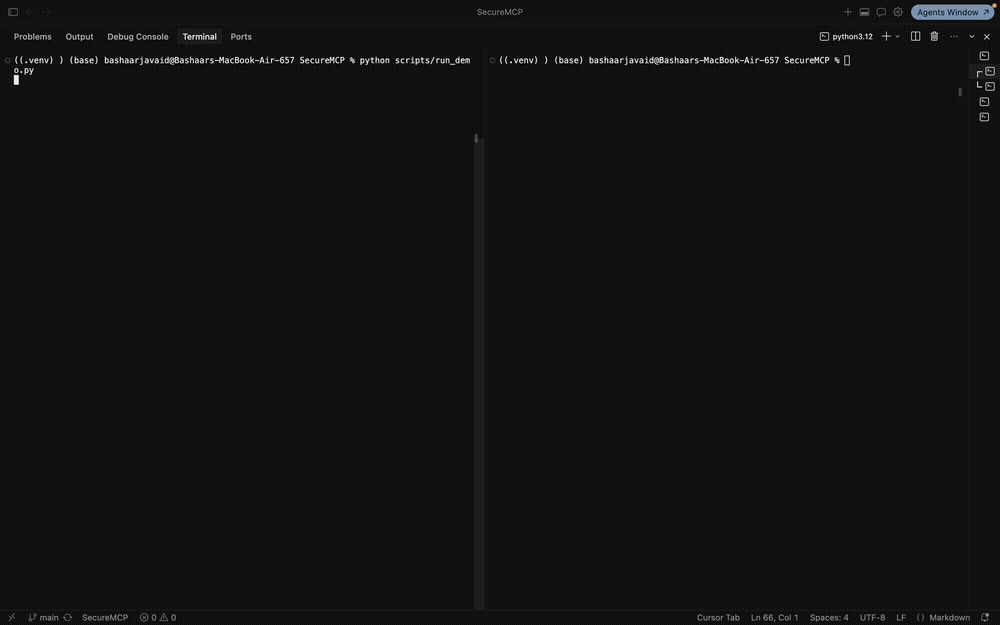
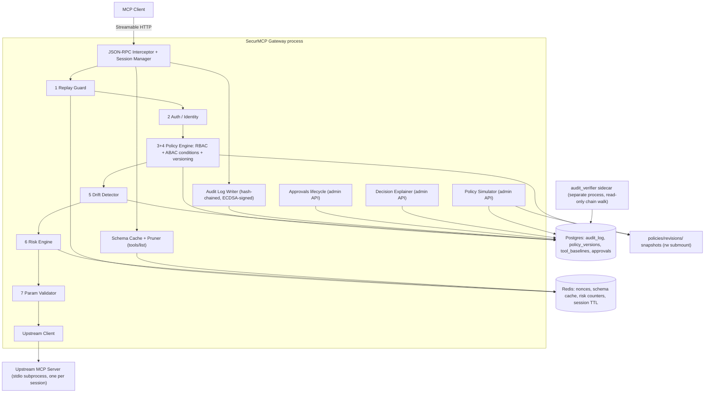

# SecurMCP

**A policy-enforcing gateway proxy for the Model Context Protocol (MCP)** — identity-scoped tool visibility, schema-drift ("rug pull") detection, per-call risk scoring, and a tamper-evident signed audit trail, with no changes required to the upstream MCP server.

[](https://github.com/BashaarJavaid/SecureMCP/actions/workflows/ci.yml)
-brightgreen)

[](./LICENSE)



*A low-privilege identity sees only the tools it's allowed. The upstream server rug-pulls its own schema mid-session. The gateway classifies the drift as Critical, blocks the call, and holds it for human re-approval. A byte-identical replay is rejected. Finally, a draft policy is simulated against the traffic that just happened.*

---

## Why

MCP defines a JSON-RPC 2.0 transport between LLM clients and tool servers, but deliberately leaves authorization, auditability, and integrity out of scope — it assumes the deploying org builds that layer. In practice almost nobody does, which leaves three concrete gaps:

1. **No identity-scoped tool visibility.** Any client that can reach a server gets the server's full `tools/list`. There is no native "this user should only see a subset of tools."
2. **Rug pulls.** A server can change a tool's schema *after* a human approved it in a prior session, with nothing to detect the drift.
3. **No audit trail.** Nothing records which identity invoked which tool with which arguments, under which policy, in a form you could later prove wasn't edited.

SecurMCP sits between the two and closes those three.

### Client compatibility — read this before you deploy it

The upstream server needs no changes. **The client currently does.** The Replay Guard requires every `tools/call` to carry a `securmcp/nonce` and `securmcp/timestamp` in `params._meta`, and denies the call (`DENY_REPLAY`) when they're missing — so a stock Claude Desktop or Cursor can complete `tools/list` (pruning works) but **every tool call it makes will be rejected**. The MCP SDK sends this natively via `call_tool(meta=...)`, so a custom agent is a two-line change; an off-the-shelf client is not.

This is the wrong default and it's the first thing Phase 5 fixes: the replay posture becomes per-identity, so stock clients work with RBAC, ABAC, drift, risk, and audit all still enforced, and hardened clients opt into cryptographically-bound replay protection. See [`ROADMAP.md`](./ROADMAP.md) item 34.

---

## Architecture

Every box inside the gateway is a module in `services/gateway/` with the same name; numbered stages are the decision pipeline in `ARCHITECTURE.md` §4.2 order. Sequence, deployment, and data-flow diagrams live in §4.4–§4.7.



**v1 fronts exactly one upstream server.** `UPSTREAM_COMMAND` is a single command and `server_id` is a single constant. The policy schema's per-server grants and `"*"` wildcards are forward-compatible structure for a server registry that does not exist yet — it's the first item in Phase 5.

---

## Threat model (summary)

The full version, including the assumptions the whole model rests on, is in [`THREAT_MODEL.md`](./THREAT_MODEL.md). It is deliberately explicit about what is *not* covered — an honest scope boundary is worth more than an implied claim of total coverage.

| Threat | Protected? | How / why not |
|---|---|---|
| Unauthorized tool access by a known identity | Yes | RBAC + ABAC policy resolution |
| Rogue / rug-pulling MCP server (schema mutation) | Yes | Drift Detector classifies mutations; High/Critical blocks at `tools/call` until re-approval |
| Contextually risky calls by an *authorized* identity | Yes | Risk Engine — challenge / human approval / deny, by score band |
| Audit-log tampering | Yes | Hash chain + per-row ECDSA signature; independently verified by a sidecar holding only the public key |
| Replay of a captured request | **Partial** | The nonce/timestamp are client-supplied and bound to no secret — this catches accidental resubmission, **not** an attacker who captured the request (the API key travels in that same request). Moving the secret off the wire is Phase 5 item 34 |
| Tool Poisoning (adversarial text in descriptions) | **No** | Descriptions are forwarded to the LLM verbatim. A server poisoned at first contact becomes its own approved baseline; a later description change is `DRIFT_LOW`, logged but not blocked. Content analysis is Phase 5 |
| Prompt injection via tool *results* | Partial | A protocol-layer gateway can log and rate-limit but not semantically evaluate result content — client/agent-framework responsibility |
| Stolen API key | Partial | Behavioral risk factors reduce blast radius; a key alone can't be distinguished from its holder |
| Compromised gateway host | No | The attacker has the signing key — an infra hardening problem, not an application one |
| Insider admin abusing legitimate access | No | Attributable and tamper-evident after the fact, not prevented; two-person activation is designed, not built |

---

## Run the demo

```bash
python scripts/generate_signing_key.py   # once: audit signing keypair (gateway won't start without it)
python scripts/run_demo.py               # resets demo state, mints keys, writes policies/demo-policy.yaml, waits
```

```bash
# in another terminal:
POLICY_FILE=policies/demo-policy.yaml \
  UPSTREAM_COMMAND="python sample_target/rogue_server.py --state /rogue-state/state.json" \
  docker compose up -d --build

# when the driver prompts — the rug pull, deliberately on screen:
curl -X POST localhost:9800/_admin/apply_mutation

# when it prompts again — hot-load the tightened v2 policy for the simulation finale:
docker kill -s HUP securemcp-gateway-1
```

The driver connects as `developer` (sees only `send_email` / `read_inbox` — the destructive `delete_mailbox` is *absent*, not marked), then as `ops-admin` (sees all three). It makes a successful call, waits for the operator's mutation curl, then shows the drift classified Critical and blocked (`DENY_DRIFT`), the admin re-approval, the same call succeeding against the new schema, a byte-identical replay rejected (`DENY_REPLAY`), and finally a Policy Simulation replaying the demo's own traffic against the v2 draft (`would_now_deny: 3`) before printing the hash-chained audit receipts.

All seven beats are live — nothing is scripted or faked. The mutation fires only when the operator actually calls that endpoint, so the adversarial event is visible on camera rather than happening off-screen on a timer.

**Development setup:** `python3.12 -m venv .venv && .venv/bin/pip install -e ".[dev]"`, then `.venv/bin/pytest`. Full command list in [`CLAUDE.md`](./CLAUDE.md).

---

## Performance

Measured, not estimated, on **2026-07-10** at commit **`902341f`** with the full §4.2 pipeline active (replay → auth → RBAC + ABAC → drift → risk scoring with all eight factors → param validation → signed audit write). Methodology, hardware, and reproduction steps: [`ARCHITECTURE.md` §9](./ARCHITECTURE.md#9-performance-benchmarks).

| Scenario | Direct call | Through gateway | Overhead |
|---|---|---|---|
| Single call, cached schema | 1.38 / 1.33 / 1.56 / 1.94 ms | 13.47 / 12.95 / 16.12 / 24.46 ms | 12.09 / 11.62 / 14.56 / 22.51 ms |
| Single call, cold schema cache | 1.38 / 1.33 / 1.56 / 1.94 ms | 16.62 / 16.17 / 19.51 / 24.71 ms | — |
| 10 concurrent sessions (p95) | — | 160.20 ms | — |
| 50 concurrent sessions (p95) | — | 565.46 ms | — |
| 100 concurrent sessions (p95) | — | 1228.23 ms | — |
| `tools/list` payload (pruned identity) | 1506 B (unpruned) | 797 B | **47.1% reduction** |

Latencies are mean / p50 / p95 / p99. The high-concurrency p95 is dominated by the synchronous fail-closed audit write contending on the Postgres pool, and by one stdio subprocess per session — both are known ceilings, discussed in `ARCHITECTURE.md` §10.

---

## Tech stack

| Layer | Choice | Why |
|---|---|---|
| Runtime | Python 3.12, FastAPI + Starlette, async throughout | First-party MCP SDK; async-native for a proxy that's almost entirely I/O wait |
| MCP handling | `mcp` official Python SDK | Don't hand-roll JSON-RPC framing — intercept at the session layer instead |
| Storage | PostgreSQL 16 (audit chain, baselines, approvals, policy versions) + Redis 7 (nonces, schema cache, risk counters) | Relational integrity matters for a hash chain; Redis for everything with a TTL |
| Policy | YAML + Pydantic, with a hand-rolled ABAC expression evaluator (`ast.parse` + node whitelist, no `eval`) | Git-diffable and validated at load. Deliberately not Turing-complete — no loops, no recursion, no code execution ([ADR-004](./docs/adr/ADR-004-no-opa-for-v1.md) on why not OPA) |
| Risk | Fixed weighted factor list + behavioral Redis counters — **no ML, by design** | A security decision an operator can't explain is a security decision they can't trust |
| Crypto | SHA-256 hash chain + ECDSA P-256 per-row signatures | The chain alone is regenerable by anyone with DB write access; the signature isn't |
| Ops | Docker Compose, Prometheus + Grafana (opt-in profile), structlog JSON logs, GitHub Actions (ruff / mypy strict / pytest with an 80% coverage gate) | |

---

## Documentation

- [`ARCHITECTURE.md`](./ARCHITECTURE.md) — decision pipeline, every component in depth, failure modes, observability, benchmarks, scalability, testing, deployment
- [`THREAT_MODEL.md`](./THREAT_MODEL.md) — what's protected, what isn't, and the assumptions underneath
- [`SECURITY.md`](./SECURITY.md) — vulnerability disclosure
- [`docs/adr/`](./docs/adr/) — one file per consequential decision, including why Envoy, OPA, Kong, NGINX, sidecars, and client-SDK middleware were each rejected for v1
- [`ROADMAP.md`](./ROADMAP.md) — the build order as a living checklist

## Roadmap

Phases 1–3 (core gateway → hardening → risk & policy features) are complete; Phase 4 is production infra and finalization.

**Phase 5 is the work that takes this from a working demo to something an AppSec team could actually adopt**, and it came out of an adversarial self-review of the finished v1: three defect fixes (sanitizer bypass, duplicated risk thresholds, uncapped risk decay), then a per-identity auth posture that both restores stock-client compatibility and makes replay protection real by moving the secret off the wire, a genuine multi-server registry, tool-description integrity, and true step-up auth.

Each item in [`ROADMAP.md`](./ROADMAP.md) states the check that proves it done and the threat-model row it upgrades — **an item is finished when that row can be honestly rewritten, not when the code merges.**

## License

MIT — see [`LICENSE`](./LICENSE).
