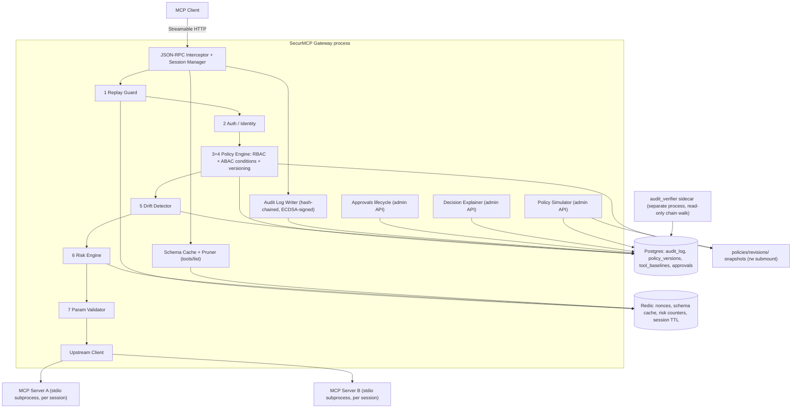

# SecurMCP

**A zero-trust, risk-aware gateway proxy for the Model Context Protocol (MCP)**

SecurMCP sits as a transparent proxy between MCP clients and real MCP servers, enforcing identity-scoped tool visibility, detecting schema drift ("rug pull" attacks), scoring the risk of individual tool calls, and producing a tamper-evident, signed audit trail — without requiring changes to either the client or the upstream servers.

## Documentation

This README is intentionally short. Deeper detail lives in dedicated files so an AI coding agent (or a human) only loads what's relevant to the task at hand, rather than the entire design on every session:

- [`ARCHITECTURE.md`](./ARCHITECTURE.md) — core architecture, decision pipeline, all components, failure modes, security hardening, observability, cache invalidation, performance benchmarks, scalability, testing strategy, CI/CD, deployment; component/deployment/data-flow diagrams live in §4.4–§4.7
- [`THREAT_MODEL.md`](./THREAT_MODEL.md) — what's protected against, what isn't, and the assumptions the whole model rests on
- [`docs/adr/`](./docs/adr/) — one file per consequential architecture decision, including why several common alternatives (Envoy, OPA, Kong, NGINX, sidecars, client-SDK middleware) weren't chosen for v1
- [`ROADMAP.md`](./ROADMAP.md) — the four-phase build order, kept as a living checklist

---

## Problem Statement

MCP defines a JSON-RPC 2.0 transport for connecting LLM clients (Claude Desktop, Cursor, custom agents) to tool servers, but the spec deliberately leaves authorization, auditability, and integrity verification out of scope — it assumes the deploying org handles that layer itself. In practice almost nobody does. This creates three concrete, exploitable gaps:

1. **No identity-scoped tool visibility.** Any client that can reach a server sees the server's full `tools/list` response. There's no native concept of "this session/user should only see a subset of tools."
2. **Tool Poisoning.** A malicious or compromised server can embed adversarial instructions inside a tool's `description` field — text the LLM reads as trusted context when deciding how to call the tool.
3. **Rug Pull Attacks.** A server can change a tool's schema, description, or behavior *after* a human has already approved it in a prior session, with no mechanism to detect the drift.

SecurMCP sits as a transparent proxy between MCP clients and real MCP servers, intercepting the JSON-RPC 2.0 conversation to enforce policy, detect drift, and produce a tamper-evident audit trail — without requiring changes to either the client or the upstream servers.

---

## Architecture

Every box inside the gateway subgraph is a module in `services/gateway/` with the same name; the numbered stages are the decision pipeline in `ARCHITECTURE.md` §4.2 order. (This diagram is a copy of §4.4, which is the source of truth — the sequence diagram, deployment diagrams, data-flow diagram, and the multi-server trust-domain discussion live in §4.1 and §4.5–§4.7.)



---

## Threat Model (summary)

The one-line version of [`THREAT_MODEL.md`](./THREAT_MODEL.md), which carries the full notes and — just as important — the explicit assumptions the model rests on (TLS termination, upstream server identity, Redis/Postgres trust boundaries):

| Threat | Protected? | How / why not |
|---|---|---|
| Tool Poisoning (adversarial text in descriptions) | Yes | Descriptions are never executed by the gateway; schema pruning limits which descriptions an identity ever sees |
| Rogue / rug-pulling MCP server | Yes | Drift Detector classifies schema mutations; High/Critical blocks at `tools/call` |
| Unauthorized tool access by a known identity | Yes | RBAC + ABAC policy resolution |
| Contextually risky calls by an *authorized* identity | Yes | Risk Engine (challenge / human approval / deny by score band) |
| Replay of a captured request | Yes | Nonce + timestamp window, Redis dedup |
| Prompt injection via tool *results* | Partial | Protocol-layer gateway can log and rate-limit but not semantically evaluate result content — client/agent-framework responsibility |
| Stolen API key | Partial | Behavioral risk factors and rate limiting reduce blast radius; a key alone can't be distinguished from its holder |
| Compromised gateway host | No | Attacker has the signing key — deployment/infra hardening problem |
| Malicious local user with container shell access | Partial | Non-root user and dropped capabilities limit, don't eliminate |
| Insider admin abusing legitimate admin-API access | No | Attributable and tamper-evident after the fact, not prevented; two-person policy activation is designed (not built) in `ROADMAP.md`'s Beyond-v1 section |

---

## Tech Stack

| Layer | Choice | Why |
|---|---|---|
| Language | Python 3.12 | Async-native ecosystem, first-party MCP SDK; avoids the context-switching cost of Go for a single-maintainer project |
| Web/proxy framework | FastAPI + Starlette | Async-native, plays well with SSE and WebSocket transports |
| MCP protocol handling | `mcp` official Python SDK | Don't hand-roll JSON-RPC 2.0 framing — use the reference client/server primitives and intercept at the session layer |
| Database | PostgreSQL 16 | Audit log, policy store, schema cache — relational integrity matters for a hash chain |
| ORM / migrations | SQLAlchemy 2.0 (async) + Alembic | Standard, typed, migration-safe |
| Caching / session state | Redis 7 | In-flight session state, rate-limit counters, short-TTL schema cache |
| Policy definition | YAML + Pydantic models | Human-readable, git-diffable, validated at load time |
| Auth (v1) | Static API-key → identity mapping, high-entropy secret compared by hash | No JWT or HMAC signing needed for v1 — a random 32-byte key stored as its SHA-256 hash is sufficient; see the Auth Layer component description for the exact scheme |
| Auth (roadmap) | OAuth 2.1 + On-Behalf-Of token exchange | Documented as Phase 4 roadmap, not blocking MVP |
| Policy expressions | Small hand-rolled boolean expression evaluator over Pydantic-typed attributes (identity, tool, context, risk_score) | Gives ABAC-style conditions without pulling in a full policy-as-code engine |
| Policy language (roadmap) | OPA/Rego or Cedar | Documented as Phase 4 roadmap only — not built; embedded evaluator above is sufficient at this scale |
| Risk Engine | Rule-based scoring: a fixed weighted factor list + behavioral Redis counters — deliberately no ML (see `ARCHITECTURE.md`, Risk Engine) | Answers "should this run right now," not just "is this identity allowed" |
| Transport | Streamable HTTP (client-facing) + stdio subprocess passthrough (upstream) | Streamable HTTP supersedes the standalone SSE transport, which the MCP spec deprecated in 2025-03 — earlier drafts of this spec said SSE. **See the stateless-replica caveat in `ARCHITECTURE.md` §4.5**: stdio ties an upstream process to the specific gateway replica that spawned it, which constrains multi-replica deployment to network-connected (non-stdio) upstream servers only |
| Replay protection | Nonce + timestamp window, deduped in Redis | Standard defense for a system fronting side-effecting calls |
| Containerization | Docker + Docker Compose (local + MVP prod), multi-stage build | Isolated subprocess execution per session |
| Orchestration (post-MVP) | AWS ECS Fargate; Kubernetes explicitly deferred | Compose + ECS is enough to prove the system works; K8s adds ops overhead with no proportional signal for v1 |
| IaC (post-MVP) | Terraform | Added after the gateway itself works — VPC, RDS, ElastiCache, ECS, ALB, Secrets Manager |
| Observability | Prometheus + Grafana (opt-in: `docker compose --profile monitoring up -d`), structured JSON logs (structlog) | Metrics on internal-only ports (labels carry identities/tools); dashboard provisioned from `monitoring/` — see `ARCHITECTURE.md` §7 |
| Testing | pytest, pytest-asyncio, httpx test client | Unit + integration + adversarial suites; hypothesis schema fuzzing deferred (ROADMAP item 23) |
| CI/CD | GitHub Actions | Lint (ruff), type-check (mypy strict), test, coverage gate, build; release pushes to GHCR on `v*` tags (ECR stays post-MVP) |
| Secrets | AWS Secrets Manager / HashiCorp Vault (local: `.env` + docker secrets) | Never plaintext in repo or logs |
| Cryptography | Python `hashlib` (SHA-256) for the chain, `cryptography` (ECDSA, P-256) for chain-segment signing | Hash-chain integrity plus tamper-proofing against a full chain regeneration |

---

## Repository Structure

```
securmcp/
├── .github/workflows/
│   ├── ci.yml                     # lint, format check, mypy, test + coverage gate, benchmark on main, build
│   └── release.yml                # build + push ghcr.io image on v* tags
├── alembic/                       # migrations 0001–0004 (audit_log + policy_versions, tool_baselines,
│                                  #   signing + verifier checkpoint, approvals)
├── docs/adr/                      # ADR-001…006 + index (FastAPI, Postgres, Redis, no-OPA, no-K8s, why-not page)
├── policies/
│   ├── example-policy.yaml
│   ├── demo-policy.yaml           # minted by scripts/run_demo.py
│   └── revisions/                 # append-only policy snapshots, one file per version (gitignored)
├── sample_target/                 # deliberately vulnerable demo MCP servers
│   ├── overscoped_server.py       # exposes tools a low-priv identity shouldn't see
│   └── rogue_server.py            # POST /_admin/apply_mutation mutates its own schema on demand
├── scripts/
│   ├── generate_api_key.py
│   ├── generate_signing_key.py    # one-time audit ECDSA keypair; gateway fails startup without it
│   ├── run_demo.py                # record-ready demo driver
│   ├── seed_policies.py
│   ├── audit_verifier_daemon.py   # incremental checkpointed verification (the compose sidecar)
│   └── verify_audit_chain.py      # full chain walk + --diff-policy revision diffing
├── services/
│   ├── gateway/
│   │   ├── main.py                # FastAPI app + admin endpoints
│   │   ├── session_manager.py     # per-client session lifecycle (Streamable HTTP ⇄ stdio subprocess)
│   │   ├── jsonrpc_interceptor.py # method dispatch + §4.2 pipeline wiring
│   │   ├── auth.py                # API key → identity, hash-and-lookup
│   │   ├── replay_guard.py        # nonce + timestamp window dedup via Redis
│   │   ├── policy_engine.py       # YAML load, RBAC grants, admin flags
│   │   ├── abac.py                # constrained ABAC expression evaluator (ADR-004)
│   │   ├── policy_versions.py     # version stamping, revision snapshots, rollback
│   │   ├── drift_detector.py      # baseline hashing + severity classification
│   │   ├── risk_engine.py         # fixed factor-list scoring + approval-driven decay
│   │   ├── param_validator.py     # JSON Schema validation + sanitization
│   │   ├── schema_cache.py        # shared Redis TTL/ETag schema cache
│   │   ├── schema_pruner.py       # identity-scoped tools/list
│   │   ├── audit_log.py           # hash-chain writer + ECDSA signing
│   │   ├── audit_verifier.py      # shared incremental verification logic
│   │   ├── approvals.py           # human-approval lifecycle (one-time redemption)
│   │   ├── decision_explainer.py  # GET /admin/decisions/{seq} + dry-run explain
│   │   ├── policy_simulator.py    # POST /admin/policy/simulate historical replay
│   │   ├── upstream_client.py     # stdio subprocess management
│   │   └── (config.py, db.py, decision.py, signing.py, logging_config.py — support modules)
│   └── audit_verifier/daemon.py   # sidecar entrypoint wrapper
├── tests/
│   ├── unit/ · integration/ · adversarial/   # adversarial: rug pulls, poisoning, replay, TOCTOU, fork
│   └── benchmarks/                # asyncio latency harness; reports gitignored, CI uploads artifact
├── docker-compose.yml             # gateway + postgres + redis + verifier sidecar + rogue admin endpoint
├── Dockerfile
├── .env.example
└── pyproject.toml
```

---

## Running the demo (the full recording-script narrative)

```bash
python scripts/generate_signing_key.py   # once: audit signing keypair (gateway won't start without it)
python scripts/run_demo.py           # resets demo state, mints keys, writes policies/demo-policy.yaml, waits
# in another terminal:
POLICY_FILE=policies/demo-policy.yaml \
  UPSTREAM_COMMAND="python sample_target/rogue_server.py --state /rogue-state/state.json" \
  docker compose up -d --build
# when the driver prompts — the rug pull, deliberately on screen:
curl -X POST localhost:9800/_admin/apply_mutation
# when the driver prompts again — activate the tightened v2 draft for the simulation finale:
docker kill -s HUP securemcp-gateway-1
```

The driver connects as `developer` (sees only `send_email`/`read_inbox` — the destructive
`delete_mailbox` is absent, not marked), then as `ops-admin` (sees all three), makes a
successful `send_email` call, waits for the operator's curl, then shows the drift being
classified Critical and blocked (`DENY_DRIFT`), the admin re-approval, the same call
succeeding with the new required `bcc`, a byte-identical replay of that call blocked
(`DENY_REPLAY`), and — after the operator's SIGHUP hot-loads a tightened v2 policy — a
Policy Simulation replaying the demo's own traffic against v2 (`would_now_deny: 3`, the
three `send_email` calls just made), finishing with the hash-chained audit receipts.
(The driver wipes the local dev audit chain, drift baselines, and risk counters at
start so reruns are repeatable.)

---

## Performance

Measured (not estimated — see `ARCHITECTURE.md` §9) on **2026-07-10** at commit **`902341f`**, on Darwin 24.6.0 arm64 (Apple Silicon), Python 3.12.13, with Postgres 16 and Redis 7 in local Docker. The full §4.2 pipeline was active: Replay Guard → auth → RBAC + ABAC conditions → drift check → Risk Engine scoring (all eight factors, Redis-backed behavioral counters included) → parameter validation → hash-chained audit write with per-row ECDSA P-256 signing.

Method: N=1000 sequential `tools/call` round trips via the MCP client SDK, timed with `time.perf_counter()`; direct = stdio client straight at `sample_target/overscoped_server.py`, gateway = the same calls through one in-process gateway. Overhead = gateway − direct. Cold cache = the Redis schema key deleted before every timed call, forcing an upstream `tools/list` re-fetch + drift check per call (the direct path has no cache, so its column repeats the baseline). Concurrency levels run 20 calls per session against the single gateway process, each session owning its own upstream stdio subprocess. Latencies are mean / p50 / p95 / p99.

| Scenario | Direct call | Through gateway | Overhead |
|---|---|---|---|
| Single call, cached schema | 1.38 / 1.33 / 1.56 / 1.94 ms | 13.47 / 12.95 / 16.12 / 24.46 ms | 12.09 / 11.62 / 14.56 / 22.51 ms |
| Single call, cold schema cache | 1.38 / 1.33 / 1.56 / 1.94 ms | 16.62 / 16.17 / 19.51 / 24.71 ms | — |
| 10 concurrent sessions (p95) | — | 160.20 ms | — |
| 50 concurrent sessions (p95) | — | 565.46 ms | — |
| 100 concurrent sessions (p95) | — | 1228.23 ms | — |
| `tools/list` payload size (pruned identity) | 1506 B (unpruned) | 797 B | **47.1% reduction** |

Peak RSS after the 100-session run: 220 MiB (gateway and benchmark harness share the process). The high-concurrency p95 is dominated by the synchronous fail-closed audit write contending on the Postgres pool and by per-session stdio subprocesses — the known ceilings discussed in `ARCHITECTURE.md` §10.

Reproduce: `docker compose up -d postgres redis && .venv/bin/python -m tests.benchmarks.run` (wipes the local dev audit chain, like the integration tests; per-run reports land in gitignored `tests/benchmarks/reports/`).

---

## Demo Target (`sample_target/`)

Two tiny MCP servers built specifically to make the gateway's value visible in a 30-second recording:

- `overscoped_server.py`: exposes tools like `read_file`, `delete_repo`, `merge_pr` with no internal authz — demonstrates schema pruning when a low-privilege identity connects.
- `rogue_server.py`: starts with a benign `send_email(to, subject, body)` tool (plus `read_inbox` and a destructive `delete_mailbox` so the pruning story works against a single upstream) and exposes a real admin endpoint, **`POST /_admin/apply_mutation`**, which swaps in a version of `send_email` with an added **required** `bcc` parameter and a poisoned description. `bcc` is required on purpose: an added *optional* parameter classifies as Medium drift and doesn't block — required is Critical, which does. There is no timer and no invisible trigger — the mutation only happens when that endpoint is actually called, deliberately, so the demo recording can show a terminal window where an operator runs `curl -X POST http://localhost:9800/_admin/apply_mutation` and the schema visibly changes as a real operation, not something that "just happens" off-screen. A demo where the adversarial behavior is invisible reads as scripted magic rather than a real system reacting to a real event. Mechanically: mutation state is a file on a bind mount shared between the `rogue` compose service (which only hosts the admin endpoint) and the per-session stdio MCP subprocesses the gateway spawns; the MCP side reads it on every `tools/list` (low-level `Server` API, not FastMCP), so even a live, long-held session sees the schema change without reconnecting.

Recording script — a single continuous story rather than a feature checklist:

1. Connect as a low-privilege identity ("Developer") — only the safe tools show up in `tools/list`, the sensitive ones are simply absent.
2. In a visible terminal window, an "admin" runs `curl -X POST .../_admin/apply_mutation` against the rogue server — the mutation is an on-screen, operator-triggered action, not a hidden timer.
3. The Developer's next call is intercepted: drift is detected and classified, and the Risk Engine independently flags the call as high-risk — execution is blocked before it reaches the tool.
4. An admin reviews the diff via `GET /admin/decisions/{id}` (Decision Explanation), approves the new schema.
5. The tool becomes available again; the same call now succeeds.
6. The Developer's client replays the exact same request a second time — the Replay Guard blocks it as a duplicate.
7. To close: run Policy Simulation against next week's draft policy over the last hour of demo traffic, and show it would have denied three of the requests just made — a live, on-camera preview of a policy change before it ships.

This single flow demonstrates schema pruning, drift classification, risk scoring, human approval, decision explanation, replay protection, and policy simulation in about 90 seconds, without feeling like a feature tour.

All seven steps are fully live and `scripts/run_demo.py` drives the entire narrative end to end — the operator supplies two on-camera actions (the mutation curl and the v2 SIGHUP). The screen recording itself is the one outstanding operator step (ROADMAP item 28).

---

## Roadmap

[`ROADMAP.md`](./ROADMAP.md) is the four-phase build order, kept as a living checklist — Phases 1–3 (items 1–23, core gateway → hardening → risk/policy features) are complete; Phase 4 is the production-infra and finalization tail. Its closing "[Beyond v1 — documented, not built](./ROADMAP.md#beyond-v1--documented-not-built-item-29)" section records the six deliberately deferred features (OAuth 2.1 On-Behalf-Of, OPA/Cedar, real step-up auth, admin UI, two-person policy activation, multi-server trust scoring) with the trigger that would justify building each.

